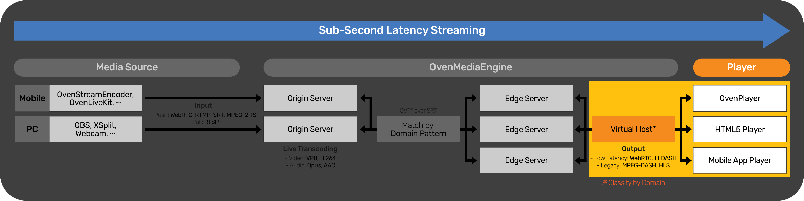

# "HTML5 player for OvenMediaEngine" OvenPlayer

## What is OvenPlayer?

In short, OvenPlayer is <b>Open-Source HTML5 Player</b>.

OvenPlayer supports WebRTC Signaling from OvenMediaEngine for Sub-Second Latency Streaming. And, it automatically plays and fallbacks using <b>WebRTC</b>, <b>Low Latency MPEG-DASH</b> (LLDASH), <b>MPEG-DASH</b>, <b>HLS</b>, and <b>RTMP</b>.

See the picture below:

We also provide [OvenMediaEngine](https://github.com/AirenSoft/OvenMediaEngine), Open-Source Sub-Second Latency Streaming Server.

## What is the goal of this project?

AirenSoft aims to make it easier for you to build a stable broadcasting/streaming service with Sub-Second Latency.
Therefore, we will continue developing and providing the most optimized tools for smooth Sub-Second Latency Streaming.

Would you mind clicking on each link below for details:
* ["Live Streaming Encoder for Mobile" <b>OvenLiveKit SDK](https://www.airensoft.com/olk)</b>
* ["Sub-Second Latency Streaming Server" <b>OvenMediaEngine](https://www.ovenmediaengine.com/ome)</b>
* ["HTML5 Player" <b>OvenPlayer](https://www.ovenmediaengine.com/ovenplayer)</b>

## Features

* HTML5 Standard Player
* Streaming Playback with Various Protocols
    * Sub-Second Latency: WebRTC (Signalling Protocol Conforms to the OME Specification)
    * Low Latency: MPEG-DASH (Chunked CMAF)
    * Legacy: MPEG-DASH, HLS
* Automatic Fallback
* Fully Customizable UI and SDK
* Insert ADs with Various Formats
    * VAST4, VAST3, VAST2, VPAID2 (HTML5), VMAP1.0.1
* Support Multiple Subtitle Formats
    * SMI, VTT, SRT

## Quick Start

Please read the [Quick Start](https://airensoft.gitbook.io/ovenplayer/#quick-start).

## API and Configuration

Start the [Demo](https://airensoft.github.io/OvenPlayer/docs/demo.html) and see [API and Configuration](https://airensoft.gitbook.io/ovenplayer/initialization) for more details.

## Build the source code

Check out [Build](https://airensoft.gitbook.io/ovenplayer/builds) section how to create `ovenplayer.js` for deployment or development after modifying the source code.

## How to contribute

We appreciate your interest in OvenPlayer.

We need your help to keep and develop our open-source project, and we want to tell you that you can contribute in many ways. Please read our [Guidelines](CONTRIBUTING.md), [Rules](CODE_OF_CONDUCT.md), and [Contribute](https://www.ovenmediaengine.com/contribute).

- [Finding Bugs](https://github.com/AirenSoft/OvenPlayer/blob/master/CONTRIBUTING.md#finding-bugs)
- [Reviewing Code](https://github.com/AirenSoft/OvenPlayer/blob/master/CONTRIBUTING.md#reviewing-code)
- [Sharing Ideas](https://github.com/AirenSoft/OvenPlayer/blob/master/CONTRIBUTING.md#sharing-ideas)
- [Testing](https://github.com/AirenSoft/OvenPlayer/blob/master/CONTRIBUTING.md#testing)
- [Improving Documentation](https://github.com/AirenSoft/OvenPlayer/blob/master/CONTRIBUTING.md#improving-documentation)
- [Spreading & Use Cases](https://github.com/AirenSoft/OvenPlayer/blob/master/CONTRIBUTING.md#spreading--use-cases)
- [Recurring Donations](https://github.com/AirenSoft/OvenPlayer/blob/master/CONTRIBUTING.md#recurring-donations)

We always hope that OvenPlayer will make your project a success.

## For more information

* [OvenPlayer Website](https://www.ovenmediaengine.com/ovenplayer) 
  * Basic Information about OvenPlayer
* [OvenPlayer Tutorial](https://airensoft.gitbook.io/ovenplayer/)
  * Quick Start, API Reference, and Examples
* Test Player
  * `Without TLS`: [http://demo.ovenplayer.com](http://demo.ovenplayer.com)
  * `With TLS`: [https://demo.ovenplayer.com](https://demo.ovenplayer.com)
* [OvenMediaEngine Github](https://github.com/AirenSoft/OvenMediaEngine)
  * Sub-Second Latency Streaming Server
* [AirenSoft Website](https://www.airensoft.com/)
  * AirenSoft's Solutions/Services, and Blog (Tech Journal)

## License

OvenPlayer is licensed under the [MIT license](LICENSE).
