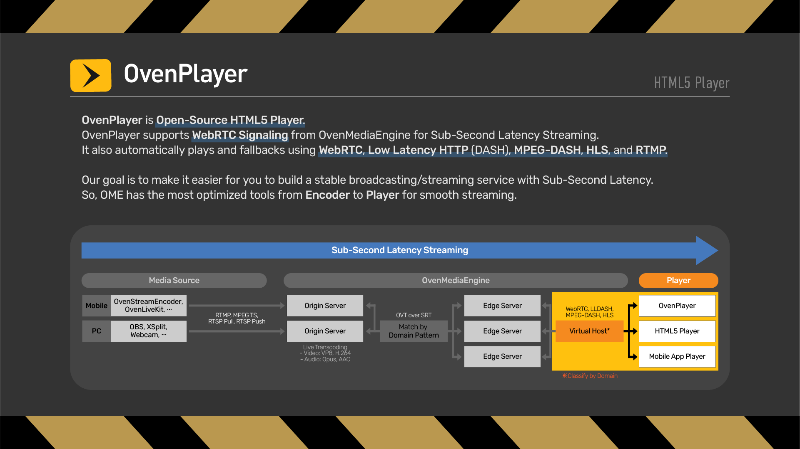
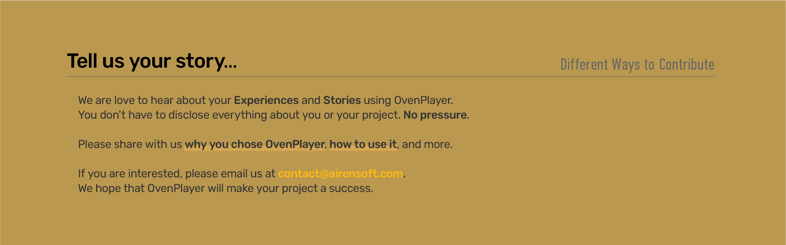

# "HTML5 player for OvenMediaEngine" OvenPlayer

## What is OvenPlayer?

OvenPlayer is <b>Open-Source HTML5 Player</b>.
OvenPlayer supports <b>WebRTC Signaling</b> from OvenMediaEngine for Sub-Second Latency Streaming. And, it automatically plays and fallbacks using <b>WebRTC</b>, <b>Low Latency HTTP</b> (DASH), <b>MPEG-DASH</b>, <b>HLS</b>, and <b>RTMP</b>.
We also provide [OvenMediaEngine](https://github.com/AirenSoft/OvenMediaEngine), Open-Source Sub-Second Latency Streaming Server.

## What is the goal of this project?

Our goal is to make it easier for you to build a stable broadcasting/streaming service with Sub-Second Latency.
So, our projects have the most optimized tools from Encoder to Player for smooth streaming.

Please click on each banner below for details.

## Features

- Ultra-low latency stream playback
- Full custom support with separate UI and SDK
- Support for playback regardless of browser and media type
- Supports all standard player functions
- Supported Protocols: WebRTC (Signalling protocol conforms to the OME specification), HLS, and MPEG-Dash
- Easily create profit by adding Ads in various formats
- Supports multiple subtitle formats (SMI, VTT, and SRT)

## Quick Start

Please read [Quick Start](https://airensoft.gitbook.io/ovenplayer/#quick-start) chapter in tutorials.

## API and Configuration

Start the [Demo](https://airensoft.github.io/OvenPlayer/docs/demo.html).

Visit [API and Configuration](docs/api.md) for more details.

## How to Contribute

Please read [Guidelines](CONTRIBUTING.md) and our [Rules](CODE_OF_CONDUCT.md).

Or we are collecting use cases. Please share your experience with [contact@airensoft.com](mailto:contact@airensoft.com). The voices of real-contributors are of great support to our project.

## License

OvenPlayer is licensed under the [MIT license](LICENSE).
