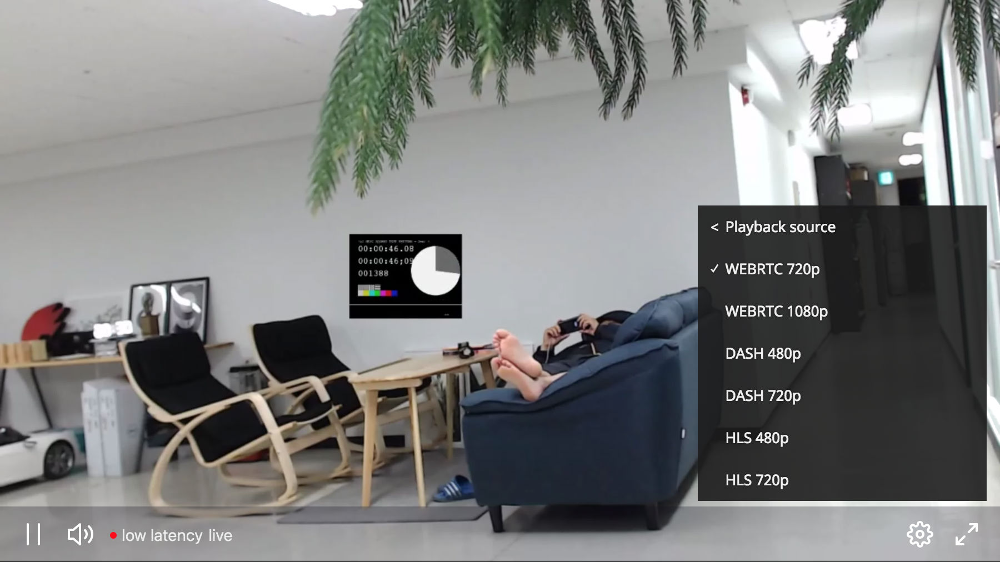

# OvenPlayer - Media player for web

The OvenPlayer is a HTML5 player designed to make it easier to play Ultra-low latency streams from the [OvenMediaEngine](https://github.com/AirenSoft/OvenMediaEngine).

## What is OvenMediaEngine?
OvenMediaEngine(OME) is a streaming engine for real-time live broadcasting with Ultra-low latency. It receives the RTMP stream from general broadcasting studios such as OBS, XSplit and transmit it on WebRTC. Video streams with Ultra-low latency can be played in a browser without plug-ins. 

## Features

- Ultra-low latency stream playback
- Full custom support with separate UI and SDK
- Support for playback regardless of browser and media type
- Supports all common player functions
- Supported Protocols : WebRTC (Signalling protocol conforms to the OME specification.), HLS, MPEG-Dash
- Easily create profit by adding Ads in various formats
- Supports various subtitle formats (SMI, VTT, SRT)

## Quick Start

Please read [Quick Start](https://airensoft.gitbook.io/ovenplayer/#quick-start) chapter in tutorials.

## API and Configuration

Start the [Demo](https://airensoft.github.io/OvenPlayer/docs/demo.html).

Visit [API and Configuration](docs/api.md) for more details.

## How to Contribute
 
Please read [Guidelines](CONTRIBUTING.md) and our [Rules](CODE_OF_CONDUCT.md).

## License

OvenPlayer is licensed under the [MIT license](LICENSE).
