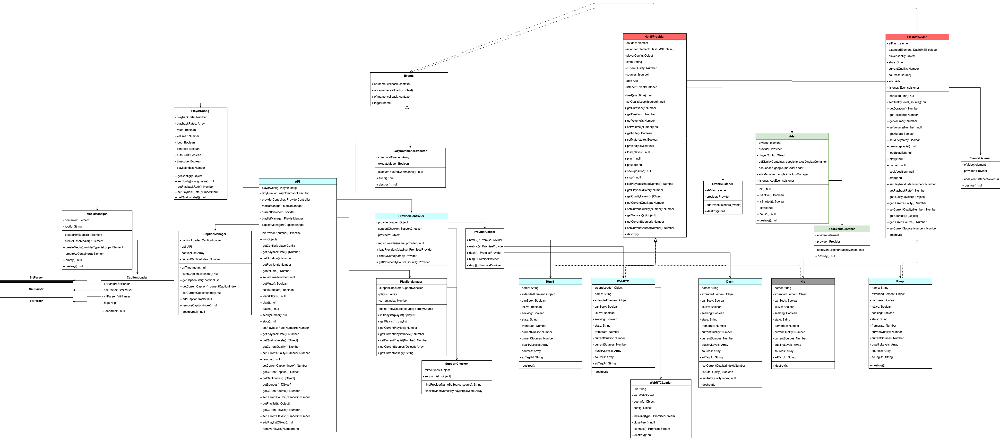

import Tabs from '@theme/Tabs';
import TabItem from '@theme/TabItem';

## API Reference

### getVersion()&#x20;

```
playerInstance.getVersion()
```

This command returns OvenPlayer version information.

### getConfig()

```
playerInstance.getConfig()
```

This command returns the configured option value when OvenPlayer is initialized.


<Tabs>
<TabItem value="request" label="Request">

| Type | Memo |
| ---- | ---- |
| null |      |

</TabItem>
<TabItem value="response" label="Response">

| **Attribute**  | Type              | Memo |
| -------------- | ----------------- | ---- |
| autoStart      | Boolean           |      |
| browser        | Object            |      |
| controls       | Boolean           |      |
| loop           | Boolean           |      |
| mediaContainer | DOMElement        |      |
| mute           | Boolean           |      |
| playbackRate   | Number            |      |
| playbackRates  | Array Of Numbers  |      |
| playlist       | Array Of playlist |      |
| timecode       | Boolean           |      |
| volume         | Number            |      |

``` title="example"
{
    autoStart: false
    browser: {screen: "1440 x 900", browser: "Chrome", browserVersion: "73.0.3683.103", browserMajorVersion: 73, mobile: false, …}
    controls: true
    loop: false
    mediaContainer: div.ovp-media-element-container
    mute: false
    playbackRate: 0.5
    playbackRates: [0.25, 0.5, 1, 1.5, 2]
    playlist: [{…}, {…}]
    timecode: true
    volume: 100
}
```

</TabItem>
</Tabs>


### **load**()

```
playerInstance.load(playlist)
```

This command initializes OvenPlayer with a new playlist.


<Tabs>
<TabItem value="request" label="Request">

| Type  | Memo                |
| ----- | ------------------- |
| Array | playlist or sources |

``` title="example"
playlist = [
        {
                title : "01",
                adTagUrl : "https://pubads.g.doubleclick.net/gampad/ads?...",
                image : "https://path.to/your_video_thumbnail.jpeg",
                duration : 7343,
                sources: [    {
                                  type : "mp4", 
                                  file :  "https://path.to/your_video", 
                                  label : "360P"
                              }],
                tracks: [{
                        kind : "captions", 
                        file :  "https://path.to/your_caption.vtt", 
                        label : "KO vtt"
                    }]
        },
        {
                        title : "02",
                        adTagUrl : "https://pubads.g.doubleclick.net/gampad/ads?...",
                        image : "https://path.to/your_video_thumbnail2.jpeg",
                        duration : 8333,
                        sources: [    {
                                          type : "mp4", 
                                          file :  "https://path.to/your_video2", 
                                          label : "360P"
                                      },
                                      {
                                          type : "mpd", 
                                          file :  "https://path.to/your_video.mpd", 
                                          label: "360P DASH"
                                      }
                        tracks: [{
                                kind : "captions", 
                                file :  "https://path.to/your_caption2.vtt", 
                                label : "KO vtt"
                            }]
                }
 ];
 
or 

sources = [
{
        type : "mp4", 
        file :  "https://path.to/your_video", 
        framerate : 30,
        label : "360P"
    },
    {
        type : "mp4", 
        file :  "https://path.to/your_video", 
        framerate : 30,
        label: "480P"
    },
    
    {
        type : "mp4", 
        file : "https://path.to/your_video", 
        framerate : 30,
        label : "720p",
        default : "true"
    }
];
```

</TabItem>
<TabItem value="response" label="Response">

```
null
```

</TabItem>
</Tabs>


### getMediaElement()

```
const videoElement = playerInstance.getMediaElement()
```


<Tabs>
<TabItem value="response" label="Response">

| Type               | Memo              |
| ------------------ | ----------------- |
| HTML Video Element | \<video>\</video> |

</TabItem>
</Tabs>


### **getState**()

```
playerInstance.getState()
```

This command gets information about what OvenPlayer is currently doing.


<Tabs>
<TabItem value="request" label="Request">

| Type | Memo |
| ---- | ---- |
| null |      |

</TabItem>
<TabItem value="response" label="Response">

| Type   | Memo                                                                                                                         |
| ------ | ---------------------------------------------------------------------------------------------------------------------------- |
| String | <p></p><p>"idle", "paused", "playing", "error", "loading", "complete", "adLoaded", "adPlaying", "adPaused", "adComplete"</p> |

</TabItem>
</Tabs>


### getBrowser()

```
playerInstance.getBrowser()
```

This command returns the analyzed information from the user agent. However, this information is not necessarily correct because the user agent can hide or misleading information.


<Tabs>
<TabItem value="request" label="Request">

| Type | Memo |
| ---- | ---- |
| null |      |

</TabItem>
<TabItem value="response" label="Response">

| Type   | Memo                   |
| ------ | ---------------------- |
| Object | User Agent Information |

``` title="example"
{
        browser: "Chrome",
        browserMajorVersion: 73,
        browserVersion: "73.0.3683.103",
        cookies: true,
        flashVersion: "no check",
        mobile: false,
        os: "Mac OS X",
        osVersion: "10_14_0",
        screen: "1440 x 900",
        ua: "Mozilla/5.0 (Macintosh; Intel Mac OS X 10_14_0) AppleWebKit/537.36 (KHTML, like Gecko) Chrome/73.0.3683.103 Safari/537.36",
        webview: false
}
```

</TabItem>
</Tabs>


### **setTimecodeMode**()

```
playerInstance.setTimecodeMode(isShow)
```

You can use this command to set whether the time-code or frame-code is displayed in the OvenPlayer control bar. However, if you want to use frame-code, the source must contain frame rate information.


<Tabs>
<TabItem value="request" label="Request">

| Type    | Memo |
| ------- | ---- |
| Boolean |      |

</TabItem>
<TabItem value="response" label="Response">

| Type | Memo |
| ---- | ---- |
| null |      |

</TabItem>
</Tabs>


### isTimecodeMode()

```
playerInstance.isTimecodeMode()
```

This command checks whether OvenPlayer is currently running in time-code or frame-code.


<Tabs>
<TabItem value="request" label="Request">

| Type | Memo |
| ---- | ---- |
| null |      |

</TabItem>
<TabItem value="response" label="Response">

| Type    | Memo                           |
| ------- | ------------------------------ |
| Boolean | true : timecode, false : frame |

</TabItem>
</Tabs>


### **getFramerate**()

```
playerInstance.getFramerate()
```

This command gets the frame-rate value of playing video. However, if you want to see frame-rate, the source or playlist must have information about frame-rate.


<Tabs>
<TabItem value="request" label="Request">

| Type | Memo |
| ---- | ---- |
| null |      |

</TabItem>
<TabItem value="response" label="Response">

| Type   | Memo |
| ------ | ---- |
| Number |      |

</TabItem>
</Tabs>


### seekFrame()

```
playerInstance.seekFrame(frameCount)
```

This command moves the playback to frameCount.


<Tabs>
<TabItem value="request" label="Request">

| Type   | Memo               |
| ------ | ------------------ |
| Number | frameCount to move |

</TabItem>
<TabItem value="response" label="Response">

| Type   | Memo             |
| ------ | ---------------- |
| Number | Moved frameCount |

</TabItem>
</Tabs>


### getDuration()

```
playerInstance.getDuration()
```

This command gets the duration of the content.


<Tabs>
<TabItem value="request" label="Request">

| Type | Memo |
| ---- | ---- |
| null |      |

</TabItem>
<TabItem value="response" label="Response">

| Type   | Memo                                |
| ------ | ----------------------------------- |
| Number | In live-broadcast, mark as Infinity |

</TabItem>
</Tabs>


### **getPosition**()

```
playerInstance.getPosition()
```

This command gets the current playing time of content.


<Tabs>
<TabItem value="request" label="Request">

| Type | Memo |
| ---- | ---- |
| null |      |

</TabItem>
<TabItem value="response" label="Response">

| Type   | Memo |
| ------ | ---- |
| Number |      |

</TabItem>
</Tabs>


### **getVolume**()

```
playerInstance.getVolume()
```

This command gets the volume value set in OvenPlayer.


<Tabs>
<TabItem value="request" label="Request">

| Type | Memo |
| ---- | ---- |
| null |      |

</TabItem>
<TabItem value="response" label="Response">

| Type   | Memo     |
| ------ | -------- |
| Number | 0 \&#126; 100 |

</TabItem>
</Tabs>


### **setVolume**()

```
playerInstance.setVolume(volume)
```

You can use this command to control volume in OvenPlayer.


<Tabs>
<TabItem value="request" label="Request">

| Type   | Memo     |
| ------ | -------- |
| Number | 0 \&#126; 100 |

</TabItem>
<TabItem value="response" label="Response">

| Type | Memo |
| ---- | ---- |
| null |      |

</TabItem>
</Tabs>


### **getMute**()

```
playerInstance.getMute()
```

This command gets if OvenPlayer is currently muted (or volume: 0).


<Tabs>
<TabItem value="request" label="Request">

| Type | Memo |
| ---- | ---- |
| null |      |

</TabItem>
<TabItem value="response" label="Response">

| Type    | Memo |
| ------- | ---- |
| Boolean |      |

</TabItem>
</Tabs>


### **setMute**()

```
playerInstance.setMute(isMute)
```

You can use this command to set mute.


<Tabs>
<TabItem value="request" label="Request">

| Type    | Memo |
| ------- | ---- |
| Boolean |      |

</TabItem>
<TabItem value="response" label="Response">

| Type    | Memo         |
| ------- | ------------ |
| Boolean | muted or not |

</TabItem>
</Tabs>


### play()

```
playerInstance.play()
```

This command plays OvenPlayer.

If OvenPlayer is not ready to play, OvenPlayer will wait until it is prepared and then play.


<Tabs>
<TabItem value="request" label="Request">

| Type | Memo |
| ---- | ---- |
| null |      |

</TabItem>
<TabItem value="response" label="Response">

| Type | Memo |
| ---- | ---- |
| null |      |

</TabItem>
</Tabs>


### **pause**()

```
playerInstance.pause()
```

This command pauses the playing content.


<Tabs>
<TabItem value="request" label="Request">

| Type | Memo |
| ---- | ---- |
| null |      |

</TabItem>
<TabItem value="response" label="Response">

| Type | Memo |
| ---- | ---- |
| null |      |

</TabItem>
</Tabs>


### **seek**()

```
playerInstance.seek(position)
```

This command moves the playback to a position.


<Tabs>
<TabItem value="request" label="Request">

| Type   | Memo    |
| ------ | ------- |
| Number | Seconds |

</TabItem>
<TabItem value="response" label="Response">

| Type | Memo |
| ---- | ---- |
| null |      |

</TabItem>
</Tabs>


### **getPlaybackRate**()

```
playerInstance.getPlaybackRate()
```

This command gets the playback speed information of content.


<Tabs>
<TabItem value="request" label="Request">

| Type | Memo |
| ---- | ---- |
| null |      |

</TabItem>
<TabItem value="response" label="Response">

| Type   | Memo |
| ------ | ---- |
| Number |      |

</TabItem>
</Tabs>


### **setPlaybackRate**()

```
playerInstance.setPlaybackRate(playbackRate)
```

You can use this command to adjust the playback speed in OvenPlayer.


<Tabs>
<TabItem value="request" label="Request">

| Type   | Memo                     |
| ------ | ------------------------ |
| Number | Playback speed to change |

</TabItem>
<TabItem value="response" label="Response">

| Type   | Memo                   |
| ------ | ---------------------- |
| Number | Changed playback speed |

</TabItem>
</Tabs>


### **getPlaylist**()

```
playerInstance.getPlaylist()
```

This command gets a registered playlist.


<Tabs>
<TabItem value="request" label="Request">

| Type | Memo |
| ---- | ---- |
| null |      |

</TabItem>
<TabItem value="response" label="Response">

| Type  | Memo |
| ----- | ---- |
| Array |      |

``` title="example"
[
        {
                title : "01",
                adTagUrl : "https://pubads.g.doubleclick.net/gampad/ads?...",
                image : "https://path.to/your_video_thumbnail.jpeg",
                duration : 7343,
                sources: [    {
                                  type : "mp4", 
                                  file :  "https://path.to/your_video", 
                                  label : "360P"
                              }],
                tracks: [{
                        kind : "captions", 
                        file :  "https://path.to/your_caption.vtt", 
                        label : "KO vtt"
                    }]
        },
...
 ]
```

</TabItem>
</Tabs>


### **getCurrentPlaylist**()

```
playerInstance.getCurrentPlaylist()
```

This command gets the index information of the playlist currently playing.


<Tabs>
<TabItem value="request" label="Request">

| Type | Memo |
| ---- | ---- |
| null |      |

</TabItem>
<TabItem value="response" label="Response">

| Type   | Memo |
| ------ | ---- |
| Number |      |

</TabItem>
</Tabs>


### setCurrentPlaylist()

```
playerInstance.setCurrentPlaylist(playlistIndex)
```

This command changes the playlist currently playing.


<Tabs>
<TabItem value="request" label="Request">

| Type   | Memo |
| ------ | ---- |
| Number |      |

</TabItem>
<TabItem value="response" label="Response">

| Type | Memo |
| ---- | ---- |
| null |      |

</TabItem>
</Tabs>


### **getSources**()

```
playerInstance.getSources()
```

This command gets information about sources from the playlist or sources of a single content currently playing.


<Tabs>
<TabItem value="request" label="Request">

| Type | Memo |
| ---- | ---- |
| null |      |

</TabItem>
<TabItem value="response" label="Response">

| Type  | Memo |
| ----- | ---- |
| Array |      |

``` title="example"
[{
file: "https://bitmovin-a.akamaihd.net/content/MI201109210084_1/mpds/f08e80da-bf1d-4e3d-8899-f0f6155f6efa.mpd",
index: 0,
label: "MPD test",
type: "dash"
}]
```

</TabItem>
</Tabs>


### **getCurrentSource**()

```
playerInstance.getCurrentSource()
```

This command gets the index information of the currently playing source.


<Tabs>
<TabItem value="request" label="Request">

| Type | Memo |
| ---- | ---- |
| null |      |

</TabItem>
<TabItem value="response" label="Response">

| Type   | Memo |
| ------ | ---- |
| Number |      |

</TabItem>
</Tabs>


### **setCurrentSource**()

```
playerInstance.setCurrentSource(index)
```

This command changes the source of the playing content. It depends on your settings, but the protocol and video quality (resolution) will change by default.


<Tabs>
<TabItem value="request" label="Request">

| Type   | Memo |
| ------ | ---- |
| Number |      |

</TabItem>
<TabItem value="response" label="Response">

| Type   | Memo                    |
| ------ | ----------------------- |
| Number | Configured source index |

</TabItem>
</Tabs>


### **getQualityLevels**()

```
playerInstance.getQualityLevels()
```

This command gets a list of resolutions if the metadata in the playing content contains quality information. And it is available when using the MPEG-DASH protocol.


<Tabs>
<TabItem value="request" label="Request">

| Type | Memo |
| ---- | ---- |
| null |      |

</TabItem>
<TabItem value="response" label="Response">

| Type  | Memo |
| ----- | ---- |
| Array |      |

``` title="example"
[
    {
        bitrate: 250000,
        height: 180,
        index: 0,
        label: "320x180, 250.0kbps",
        width: 320
    },
    ...
]
```

</TabItem>
</Tabs>


### **getCurrentQuality**()

```
playerInstance.getCurrentQuality()
```

This command gets the index of the current video quality information.


<Tabs>
<TabItem value="request" label="Request">

| Type | Memo |
| ---- | ---- |
| null |      |

</TabItem>
<TabItem value="response" label="Response">

| Type   | Memo |
| ------ | ---- |
| Number |      |

</TabItem>
</Tabs>


### **setCurrentQuality**()

```
playerInstance.setCurrentQuality(index)
```

You can use this command to set to play as index quality.


<Tabs>
<TabItem value="request" label="Request">

| Type   | Memo |
| ------ | ---- |
| Number |      |

</TabItem>
<TabItem value="response" label="Response">

| Type | Memo |
| ---- | ---- |
| null |      |

</TabItem>
</Tabs>


### **isAutoQuality**()

```
playerInstance.isAutoQuality()
```

This command checks whether the video quality has been set to change automatically based on internet status, condition, and more.


<Tabs>
<TabItem value="request" label="Request">

| Type | Memo |
| ---- | ---- |
| null |      |

</TabItem>
<TabItem value="response" label="Response">

| Type    | Memo |
| ------- | ---- |
| Boolean |      |

</TabItem>
</Tabs>


### **setAutoQuality**()

```
playerInstance.setAutoQuality(isAuto)
```

You can use this command to set whether to change the video quality automatically.


<Tabs>
<TabItem value="request" label="Request">

| Type    | Memo |
| ------- | ---- |
| Boolean |      |

</TabItem>
<TabItem value="response" label="Response">

| Type | Memo |
| ---- | ---- |
| null |      |

</TabItem>
</Tabs>


### **getCaptionList**()

```
playerInstance.getCaptionList()
```

It reads the list of registered subtitles in the current playlist.


<Tabs>
<TabItem value="request" label="Request">

| Type | Memo |
| ---- | ---- |
| null |      |

</TabItem>
<TabItem value="response" label="Response">

| Type  | Memo |
| ----- | ---- |
| Array |      |

```
[
    {
    data : [VTTCue],
    file: captionUrl,
    id: "captions0",
    kind: "captions",
    label: "KO vtt",
    name: "KO vtt",
    }
]
```

</TabItem>
</Tabs>


### getCurrentCaption()

```
playerInstance.getCurrentCaption()
```

This command gets the index of the using subtitle in the current playlist.


<Tabs>
<TabItem value="request" label="Request">

| Type | Memo |
| ---- | ---- |
| null |      |

</TabItem>
<TabItem value="response" label="Response">

| Type   | Memo |
| ------ | ---- |
| Number |      |

</TabItem>
</Tabs>


### **setCurrentCaption**()

```
playerInstance.setCurrentCaption(index)
```

You can use this command to set the subtitle of the current playlist to the caption of the index.


<Tabs>
<TabItem value="request" label="Request">

| Type   | Memo |
| ------ | ---- |
| Number |      |

</TabItem>
<TabItem value="response" label="Response">

| Type | Memo |
| ---- | ---- |
| null |      |

</TabItem>
</Tabs>


### addCaption()

```
playerInstance.addCaption(track)
```

You can use this command to add subtitles to the current playlist.


<Tabs>
<TabItem value="request" label="Request">

| Type   | Memo |
| ------ | ---- |
| Object |      |

```
{
    kind: "captions",
    file: captionUrl,
    label: "KO vtt"
}
```

</TabItem>
<TabItem value="response" label="Response">

| Type | Memo |
| ---- | ---- |
|      |      |

</TabItem>
</Tabs>


### removeCaption()

```
playerInstance.removeCaption(index)
```

You can use this command to remove the subtitle corresponding to the index from the current playlist.


<Tabs>
<TabItem value="request" label="Request">

| Type   | Memo |
| ------ | ---- |
| Number |      |

</TabItem>
<TabItem value="response" label="Response">

| Type | Memo |
| ---- | ---- |
| null |      |

</TabItem>
</Tabs>


### **stop**()

```
playerInstance.stop()
```

This command stops playing and moves the playback position to 0.


<Tabs>
<TabItem value="request" label="Request">

| Type | Memo |
| ---- | ---- |
| null |      |

</TabItem>
<TabItem value="response" label="Response">

| Type | Memo |
| ---- | ---- |
| null |      |

</TabItem>
</Tabs>


### showControls()

```
playerInstance.showControls(show)
```

This API can show or hide the player's control area.


<Tabs>
<TabItem value="request" label="Request">

| Type    | Memo                                       |
| ------- | ------------------------------------------ |
| Boolean | set true or false to show or hide controls |

</TabItem>
<TabItem value="response" label="Response">

| Type | Memo |
| ---- | ---- |
| null |      |

</TabItem>
</Tabs>


### remove()

```
playerInstance.remove()
```

This command removes the player and releases all resources.

## Architectures


