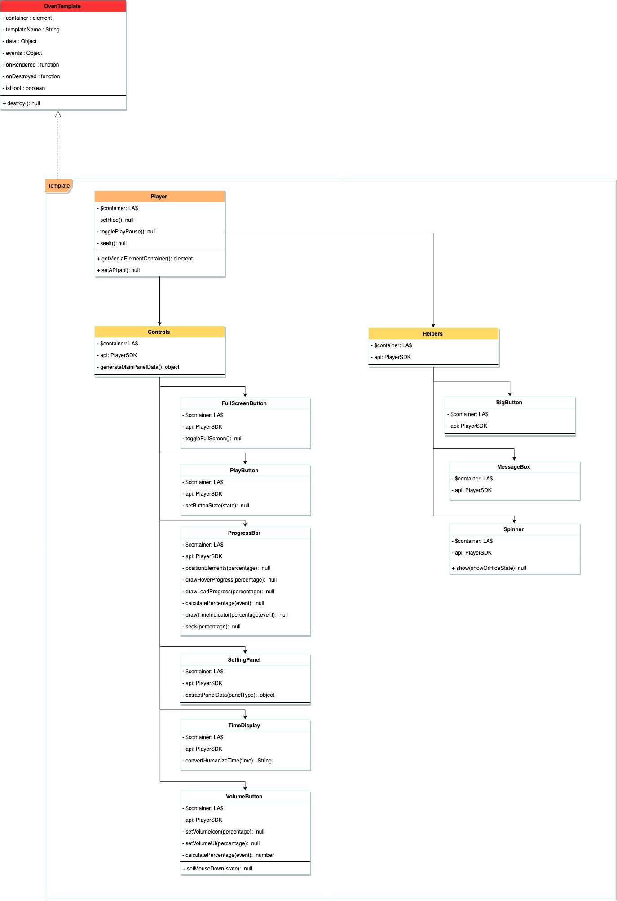
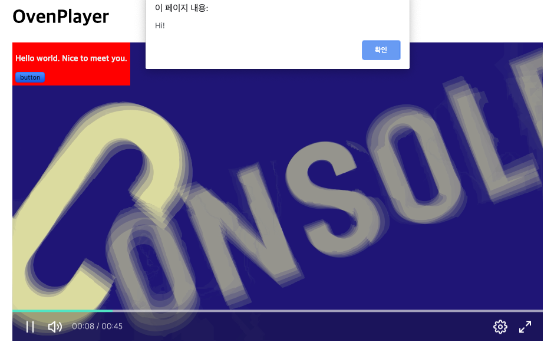

## CSS Skinning

### How to change accent the color

You can easily change the color by overriding the `--op-accent-color` class in your web page:

```
<!doctype html>
<html lang="en">
<head>
    <meta charset="UTF-8" />
    <title>OvenPlayer</title>
    <style>

        /* Change the accent color */
        #player_id {
            --op-accent-color: red;
        }

    </style>
</head>
<body>

<div id="player_id"></div>

<script src="https://cdn.jsdelivr.net/npm/ovenplayer/dist/ovenplayer.js"></script>
<script>

    // Initialize OvenPlayer
    const player = OvenPlayer.create('player_id', {
        sources: [
            ...
        ]
    });
</script>
</body>
</html>
```

### How to style captions

Captions are drawn as DOM elements rather than by the browser's native caption renderer, so all of their styling can be overridden from your page — no player option is needed.

One rule applies to every example below: OvenPlayer injects its own stylesheet at runtime, so it usually comes after the styles in your page. Give your override a higher specificity by prefixing it with the player id. OvenPlayer moves the id you pass to `create()` onto its own root element, so `#player_id` selects the player root and beats the player's own class-only selectors.

#### Caption safe area

`.op-caption-text-container` is inset on all four sides and acts as the caption safe area. Cue boxes fill it exactly, so a caption can never sit flush against a player edge whatever `line`, `position` and `size` the cue asks for. Percentages in cue settings resolve against this area, not against the whole player.

| Property | Default |
| --- | --- |
| `top`, `right`, `bottom`, `left` | `2%` |

```
/* Hold captions clear of the control bar at the bottom */
#player_id .op-caption-text-container {
    top: 2%;
    right: 2%;
    bottom: 10%;
    left: 2%;
}
```

`top` and `bottom` percentages resolve against the player height, `left` and `right` against its width, so the same percentage is a smaller gap vertically. Use `px` or `em` if you want an identical gap on all four sides.

#### Caption font size

`.op-caption-text` carries the text style. Its size is expressed in `em` against the player root, whose font size OvenPlayer switches according to the player width. There is therefore a base rule plus one override per size class:

| Selector | Player root | Caption `font-size` | Rendered |
| --- | --- | --- | --- |
| `.op-caption-text` | – | `1.5em` | base rule |
| `.large .op-caption-text` | `14px` | `2em` | 28px |
| `.medium .op-caption-text` | `12px` | `1.75em` | 21px |
| `.small .op-caption-text` | `10px` | `1.6em` | 16px |
| `.xsmall .op-caption-text` | `10px` | `1.3em` | 13px |

A single id-prefixed rule outranks all of them, so you only need one. Keep the unit in `em` to stay responsive, since the player root font size still changes with the player width:

```
/* Larger than the default, still scaling with the player */
#player_id .op-caption-text {
    font-size: 2.5em;
}
```

Use an absolute unit instead if you want one fixed size at every player width:

```
#player_id .op-caption-text {
    font-size: 24px;
    line-height: 1.4;
}
```

#### Caption text box

The same element draws the box behind the text.

| Property | Default |
| --- | --- |
| `color` | `#fff` |
| `background` | `rgba(8, 8, 8, 0.75)` |
| `padding` | `.25em .6em` |
| `border-radius` | `.25em` |
| `line-height` | `1.5em` |

```
/* Plain white text with a shadow instead of a filled box */
#player_id .op-caption-text {
    background: none;
    padding: 0;
    text-shadow: 0 2px 4px rgba(0, 0, 0, 0.9);
}
```

#### WebVTT cue classes

Cue text markup is parsed, so `<b>`, `<i>`, `<u>`, `<ruby>`, `<rt>`, `<v Speaker>`, `<lang xx>` and `<c.class>` all take effect. The standard WebVTT colour classes are styled for you:

`white`, `lime`, `cyan`, `red`, `yellow`, `magenta`, `blue`, `black`, and `bg_white` … `bg_black` for backgrounds.

Any other class name is passed through to the DOM, so you can define your own:

```
00:00:01.000 --> 00:00:03.000
<c.yellow>Yellow</c>, and <c.speaker>a class of your own</c>
```

```
#player_id .op-caption-text .speaker {
    color: #50e3c2;
    font-weight: 700;
}
```

### How to change the style

```
ovenplayer
...
├── src/
│    ├── assets/
│    │    ├── fonts/
│    │    └── images/
│    ...
│    └── stylesheet/
│        └── ovenplayer.less
...
```

`assets/` contains the image file used as the button in OvenPlayer. And you can modify the style yourself in `stylesheet/ovenplayer.less`.

If you want to know how to build and run, go to the [Builds](builds.md) tab.

## Add and Edit a new UI

```
ovenplayer
...
├── src/
│    ├── js/
│    │    ├── api/
│    │    ├── utils/
│    │    └── view/
│    │         ├── components/
│    │         ├── engine/
│    │         │    ├── OvenTemplate.js
│    │         │    └── Templates.js
│    │         ├── example/
│    │         ├── global/
│    │         ├── view.js
│    │         └── viewTemplate.js
...
```

The view of OvenPlayer has consisted of a template that extended OvenTemplate.

The template has a minimal life cycle starting with `onRendered()` and ending with `onDestroyed()`, and you can set an event callback with a valid scope in the template.



The top-level parent template is `view/view.js`. View creates child `Controls` and `Helpers` templates. Also, Controls and Helpers create and control child templates, respectively.

Through our example `TextView (view/example/textview.js)`, we will explain in the following part how child templates are created, controlled, and passed data by the parent template.

### Register a template

The OvenPlayer template has a pair of `controller` and `view`, each named `{templateName}.js` and `{templateName}Template.js`.

```
ovenplayer
...
├── src/
│    ├── js/
│    │    ├── api/
│    │    ├── utils/
│    │    └── view/
│    │         ├── components/
│    │         ├── engine/
│    │         ├── example/
│    │         │    ├── textview.js
│    │         │    └── textviewTemplate.js
...
```

You need to register `view` separately in Templates.

We have configured `textviewTemplate.js` corresponding to the view in the TextView. So you register `textviewTemplate.js` in `view/engine/Templates.js`.

``` title="view/engine/Templates.js"
import TextViewTemplate from 'view/example/textviewTemplate';
import ViewTemplate from 'view/viewTemplate';
import HelpersTemplate from 'view/components/helpers/mainTemplate';
...

const Templates = {
    TextViewTemplate,
    ViewTemplate,
    HelpersTemplate,
    BigButtonTemplate,
    ...
};

export default Templates;
```

### Use a template

In this part, we will show you how to create the TextView in `helpers/main.js`, the top-level parent of Helpers.

You import `textview.js` which is `controller` in the TextView.

``` title="view/components/helpers/main.js"
import OvenTemplate from "view/engine/OvenTemplate";
import BigButton from "view/components/helpers/bigButton";
import MessageBox from "view/components/helpers/messageBox";
import CaptionViewer from "view/components/helpers/captionViewer";
import Spinner from "view/components/helpers/spinner";
//It adds a textview template for testing.
import TextView from 'view/example/textview'; 
...

const Helpers = function($container){
let bigButton = "", messageBox = "",  captionViewer = "", spinner = "", textView; 
 ...
 
 const onRendered = function($current, template){
  //It creates the TextView right after Helper is loaded on the screen.
  textView = TextView($current, api, "Hello world. Nice to meet you.");
  ...
  
 });
 
 //Callback that is called when Helpers are removed in OvenPlayer.
 const onDestroyed = function(template){
  textView.destroy(); //When Helpers, which is the parent template, is removed, the textView is also removed.
  
  api.off(READY, null, template);
  api.off(PLAYER_STATE, null, template);
  ...
 };
 
 //The event to be used by Helpers. However, Helpers are used as a container for the template, so there are no special events.
 const events = {
 };
 
 return OvenTemplate($container, "Helpers", null, events, onRendered, onDestroyed );
};

export default Helpers;
```

The source of the `TextView` is:

``` title="/view/example/textview.js"
import OvenTemplate from 'view/engine/OvenTemplate';

const TextView = function($container, api, text){

    const onRendered = function($current, template){
    };
    
    const onDestroyed = function(template){
        //Do nothing.
    };
    
    const events = {
        "click .btn" : function(event, $current, template){
            event.preventDefault();
            alert("Hi!");
        }
    };

    return OvenTemplate($container, "TextView", text events, onRendered, onDestroyed );

};

export default TextView;
```

`$container` means the parent's element, and in onRendered(), onDestroyed(), and events(), `$current` means the element owned by each item.

``` title="/view/example/textviewTemplate.js"
const TextViewTemplate = function(text){
    return `<div class="textView" style="padding : 5px; background: red; position : absolute; top: 0;">` +
                `<h3>${text}</h3>` +
                `<button type="button" class="btn">button</button>` +
            `</div>`;
};

export default TextViewTemplate;
```

### LikeA$&#x20;

`$container` and `$current` in OvenPlayerTemplate consist of `LikeA$` object.

#### Create LikeA$ object

```
import LA$ from 'utils/likeA$';
... 

let $player = LA$("#player");
```

#### Search element

```
$player.find(".textView");
```

#### Access element

```
$player.find(".textView").get();
```

#### Edit CSS

```
$player.find(".textView").css("color", "#d9d9d9");
```

Please check `/utils/likeA$.js` for more information. This is slightly more inconvenient than jquery but enough to control OvenPlayer.

## Build and Run

You can build OvenPlayer through the  [Builds](builds.md) chapter.

```
npm run watch
```

You can see the added TextView by building OvenPlayer and running `dist/development/ index.html`.



In this way, you can add a new UI or customize the template.
