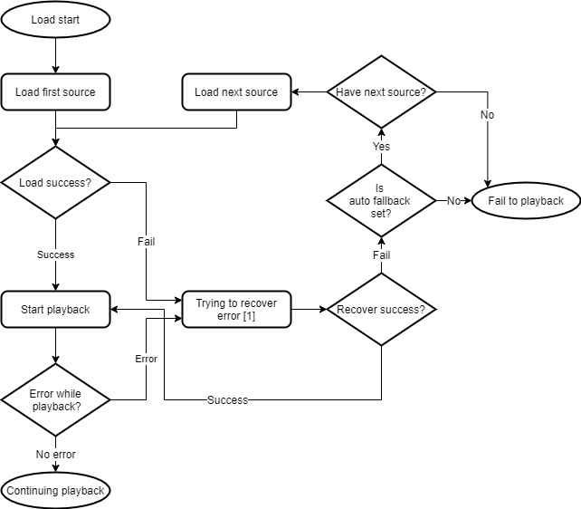

# Error Handling

## Error handling diagram

This diagram explains how OvenPlayer handles errors and automatic fallback operations.

### \[1] Trying to recover error

Error recovering is different for each protocol.

#### HLS

Errors thrown by `hls.js` are differentiated by whether they are fatal or not. For a none fatal error, `hls.js` automatically repairs the error. How to handle it is described [here](https://github.com/video-dev/hls.js/blob/master/docs/design.md#error-detection-and-handling).

